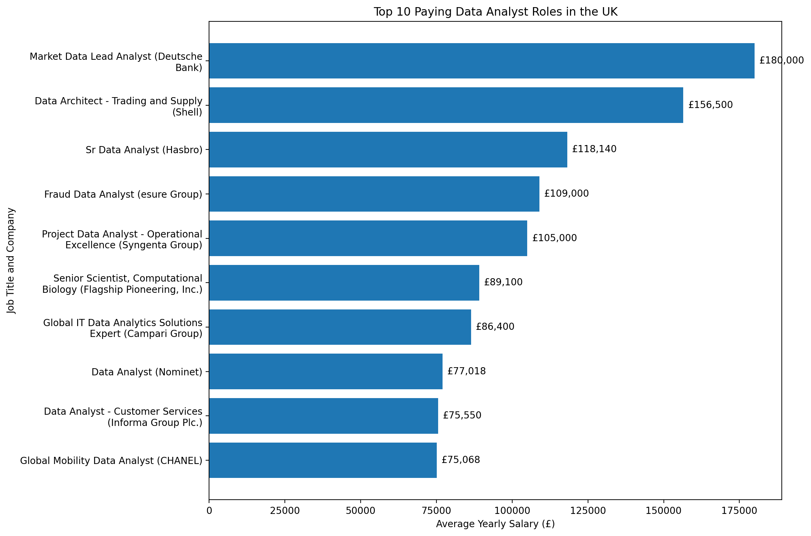
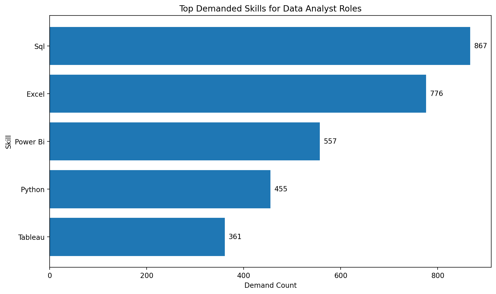
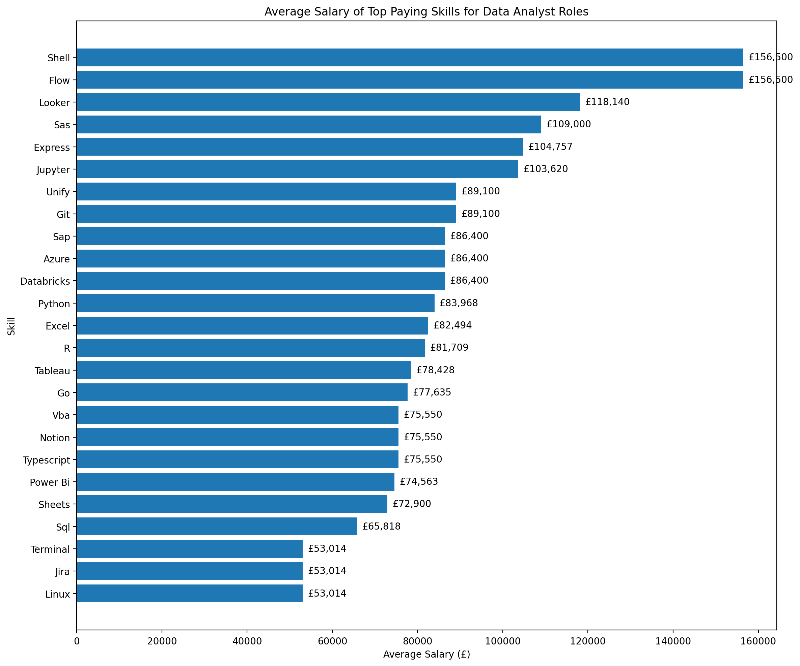

# Introduction
Dive into the Data job Market. Focusing on Data Analyst roles, this projects explores top paying jobs , in demand skills and where high demand meets high salary in Data Analytics. 

SQL queries? Check them out here: [project_sql folder](/project_sql/)
# Questions i wanted to Answer
1) What are the Top Paying Data Analyst jobs in UK ?
2) What skills are required for these top paying jobs ?
3) what skills are most in demand for data analysts ?
4) which skills are associated with high salaries ?
5) What are the most Optimal skills to learn ?

# Tools that i used
For my deep dive into Data Analyst job market , I used several key tools

- **SQL** : The Backbone of my Analysis, allowing me to query the database and extract key insights 

- **PostgreSQL** : The chosen Database Managment System , ideal for handling job posting Data 

- **Visual Studio Code** : For Database Management and writing and executing SQL queries. 

- **Git and Github** : Essential for Version Control, and sharing my SQL scripts and analysis , ensuring collaboration and Project Tracking 
# The Analysis 

### 1) Top Paying Jobs 
Queried `job_postings_fact` for UK listings with `job_title_short` containing 'Data Analyst', excluded NULL `salary_year_avg`, joined `company_dim` for company names, ordered by average yearly salary DESC, and returned the top 10 roles. This highlights high-paying Data Analyst opportunities in the United Kingdom.

The Query : 
```sql
SELECT
    job_id,
    job_title,
    job_location,
    job_schedule_type,
    salary_year_avg,
    job_posted_date,
    name AS company_name
FROM
    job_postings_fact 
LEFT JOIN
    company_dim ON job_postings_fact.company_id = company_dim.company_id
WHERE
    job_title_short = 'Data Analyst' AND
    job_location LIKE '%United Kingdom%' AND
    salary_year_avg IS NOT NULL
ORDER BY
    salary_year_avg DESC
LIMIT 10;
```

 Image showing the results 


Here is the Breakdown of the Top paying Data Analyst jobs of 2023: 

- The highest paying Data Analyst role is the Market Data Lead Analyst at Deutsche Bank, with an average yearly salary of £180,000.
- Shell offers a Data Architect position with an average salary of £156,500, which is also a high-paying role in the data analysis field.
- The salaries for Data Analyst roles in the United Kingdom vary significantly, with the lowest in the top 10 being around £75,067.5 for a Global Mobility Data Analyst at CHANEL. 


### 2) Skills of Top Paying Jobs 

To understand what skills are required for the top paying Data Analyst jobs, i joined the job_postings fact with the skills data. 
Here is the Query : 
```sql
WITH top_paying_jobs AS (
    SELECT
        job_id,
        job_title,
        job_location,
        job_schedule_type,
        salary_year_avg,
        job_posted_date,
        name AS company_name
    FROM
        job_postings_fact 
    LEFT JOIN
        company_dim ON job_postings_fact.company_id = company_dim.company_id
    WHERE
        job_title_short = 'Data Analyst' AND
        job_location LIKE '%United Kingdom%' AND
        salary_year_avg IS NOT NULL
    ORDER BY
        salary_year_avg DESC
    LIMIT 10
)

SELECT 
    top_paying_jobs.*,
    skills
FROM top_paying_jobs
INNER JOIN skills_job_dim ON top_paying_jobs.job_id = skills_job_dim.job_id
INNER JOIN skills_dim ON skills_job_dim.skill_id = skills_dim.skill_id
ORDER BY salary_year_avg DESC
limit 10;
```
Here is the Breakdown of the most demanded skills for top 10 paying data analyst jobs in UK : 


1. The top-paying UK Data Analyst roles ask for technical skills like Excel, Shell, Express, Flow, SQL, Python, Jupyter, Tableau, and Power BI.
2. Excel appears often, showing its value for data manipulation and visualization.
3. Shell and Express are useful for specialized high-paying roles in data architecture and trading/supply chain analytics.
4. SQL and Python are essential for querying, analysis, automation, and working with large datasets.
5. Jupyter, Tableau, and Power BI are key for visualization and reporting, helping analysts communicate insights with dashboards and charts.

### 3) In demand skills for Data Analysts

This query helped identify the skills most frequently requested in job postings, directing focus to areas with high demand. 

```sql
SELECT 
    skills,
    COUNT(skills_job_dim.job_id) AS demand_count

FROM job_postings_fact
INNER JOIN skills_job_dim ON job_postings_fact.job_id = skills_job_dim.job_id
INNER JOIN skills_dim ON skills_job_dim.skill_id = skills_dim.skill_id
WHERE job_title_short = 'Data Analyst' AND job_location = 'United Kingdom'
GROUP BY skills
ORDER BY demand_count DESC
LIMIT 5;
```




Here is the breakdown of the most demanded skills for Data Analyst roles in UK .
1. SQL is the most in-demand skill for Data Analysts in the UK, with 867 job postings requiring it. This highlights the importance of SQL for data manipulation and querying in the field.
2. Excel is also highly sought after, with 776 job postings mentioning it. This indicates that proficiency in Excel is essential for data analysis tasks, such as data cleaning and visualization.
3. Power BI, Python, and Tableau are also in high demand, with 557, 455, and 361 job postings respectively. These skills are crucial for data visualization, analysis, and reporting, making them valuable for Data Analysts to learn.
4. Aspiring Data Analysts should consider focusing on these top skills to enhance their employability and meet the demands of the job market in the United Kingdom.

### 4) Top skills based on salary 

What i did: To identify the top paying skills for Data Analyst roles in the United Kingdom, I queried the ```job_postings_fact``` table to filter for job titles containing ```'Data Analyst'``` and locations within the ```United Kingdom.``` I ensured that only listings with specified salary ranges were included by excluding NULL values in the``` salary_year_avg column.``` The results were then ordered by average yearly salary in descending order, and I limited the output to the top 25 highest paying skills. Additionally, I joined with the ```skills_job_dim``` and ```skills_dim tables ```to include skill names for context on the technical requirements of these positions.

This query highlights the high-paying technical skills in demand for Data Analyst roles within the United Kingdom.

```sql
SELECT 
    skills,
    ROUND(AVG(salary_year_avg), 0) AS average_salary

FROM job_postings_fact
INNER JOIN skills_job_dim ON job_postings_fact.job_id = skills_job_dim.job_id
INNER JOIN skills_dim ON skills_job_dim.skill_id = skills_dim.skill_id
WHERE job_title_short = 'Data Analyst' AND salary_year_avg IS NOT NULL AND job_location = 'United Kingdom'
GROUP BY skills
ORDER BY average_salary DESC

LIMIT 25;
```




Here is the break down of the top paying skills for Data Analyst roles in the United Kingdom: 

Higher-paying data analyst roles are becoming more technical, with skills like Shell, Git, Azure, Databricks, Python, Linux, and Terminal showing strong salary potential.

BI and visualisation tools remain highly valued, with Looker, Tableau, and Power BI appearing in the top-paying skills, showing demand for analysts who can turn data into clear business insights.

SQL and Excel are still important foundations, but the highest salaries appear when they are combined with programming, cloud platforms, automation, and advanced analytics tools.

### 5) The Optimal Skills for Data Analysts in UK 

To identify the top-paying skills for Data Analyst roles in the United Kingdom, I filtered job_postings_fact for UK Data Analyst listings with non-null average yearly salaries. I joined skills_job_dim and skills_dim to include skill names, ordered results by salary descending, and limited the output to the top 25 skills.

This query highlights the high-paying technical skills in demand for UK Data Analyst roles.

```sql
WITH skills_demand AS ( 
    SELECT 
        skills_dim.skill_id,
        skills_dim.skills,
        COUNT(skills_job_dim.job_id) AS demand_count

    FROM job_postings_fact
    INNER JOIN skills_job_dim ON job_postings_fact.job_id = skills_job_dim.job_id
    INNER JOIN skills_dim ON skills_job_dim.skill_id = skills_dim.skill_id
    WHERE job_title_short = 'Data Analyst' AND job_location = 'United Kingdom' AND salary_year_avg IS NOT NULL
    GROUP BY skills_dim.skill_id
    
), average_salary AS (
    SELECT 
        skills_job_dim.skill_id,
        
        ROUND(AVG(salary_year_avg), 0) AS average_salary

    FROM job_postings_fact
    INNER JOIN skills_job_dim ON job_postings_fact.job_id = skills_job_dim.job_id
    INNER JOIN skills_dim ON skills_job_dim.skill_id = skills_dim.skill_id
    WHERE job_title_short = 'Data Analyst' AND salary_year_avg IS NOT NULL AND job_location = 'United Kingdom'
    GROUP BY skills_job_dim.skill_id

)

SELECT
    skills_demand.skill_id,
    skills_demand.skills,
    demand_count,
    average_salary
FROM
    skills_demand
    INNER JOIN average_salary ON skills_demand.skill_id = average_salary.skill_id

ORDER BY
    demand_count DESC,
    average_salary DESC
```


1. The most in-demand skills for Data Analysts in the United Kingdom are Excel, Python, and SQL, with Excel having the highest demand count of 11 job postings.
2. Python has the highest average salary of £83,968 among the top demanded skills, indicating that proficiency in Python can lead to better-paying opportunities.
3. Other valuable skills include Tableau and Power BI, which are also in demand and offer competitive salaries.


# What i learnt 
# Conclusions 


